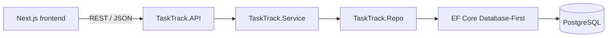
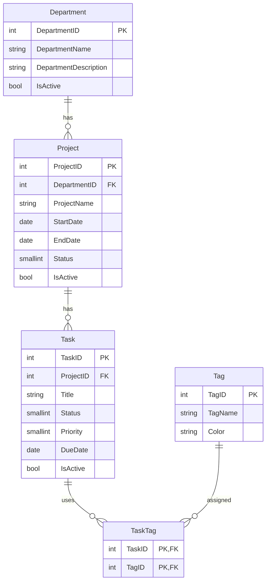

# PRN232 TaskTrack Assignment 1

[](https://github.com/PhucPhamHong-dev/PRN232_TaskTrackAssignment/actions/workflows/ci.yml)

TaskTrack is a public task and team management application built with ASP.NET Core 8, PostgreSQL, Entity Framework Core Database-First, Next.js App Router, TypeScript, and Tailwind CSS.

## Live application

- Frontend: [https://qe190133-prn232-ass1-fe.vercel.app](https://qe190133-prn232-ass1-fe.vercel.app)
- Backend API: [https://qe190133-prn232-ass1-be.onrender.com](https://qe190133-prn232-ass1-be.onrender.com)
- Backend Swagger: [https://qe190133-prn232-ass1-be.onrender.com/swagger](https://qe190133-prn232-ass1-be.onrender.com/swagger)
- Source repository: [PhucPhamHong-dev/PRN232_TaskTrackAssignment](https://github.com/PhucPhamHong-dev/PRN232_TaskTrackAssignment)

## Features

- Public dashboard with live department, project, and task totals.
- Department, project, task, and tag CRUD without authentication.
- Department and project details with related data.
- Task search by title, status, priority, project, and tag.
- Status and priority badges, modal forms, delete confirmations, validation, loading states, error states, and toast notifications.
- Soft-delete for tasks and relationship checks before deleting departments, projects, or tags.
- Swagger API documentation and a GitHub Actions CI/CD quality gate.
- Responsive layouts for desktop and mobile.

## Architecture



The backend follows the required layered design. Controllers only call services; services contain validation and business rules; all database access is isolated in the repository project.

## Database ERD



## Repository structure

- `backend/TaskTrack.API` — controllers, middleware, Swagger, CORS, and application startup.
- `backend/TaskTrack.Service` — DTOs, service interfaces, validation, and business logic.
- `backend/TaskTrack.Repo` — scaffolded EF Core entities, DbContext, and repository implementation.
- `frontend/StudentID_ClassCode_Ass1_FE` — Next.js public and management pages.
- `.github/workflows/ci.yml` — backend, Docker, frontend, and production smoke-test pipeline.
- `.github/scripts/smoke-test.sh` — retry-based validation for all four submission links.

## Local setup

Requirements: .NET 8 SDK, Node.js 22 or later, and a PostgreSQL database initialized with the supplied `TaskManagementDB_Postgres.sql` file.

1. Clone the repository.
2. Run the supplied SQL script against PostgreSQL without changing its schema.
3. Copy `backend/TaskTrack.API/appsettings.Local.example.json` to `backend/TaskTrack.API/appsettings.Local.json` and enter the PostgreSQL connection string. This private file is ignored by Git.
4. Start the backend:

   ```bash
   cd backend
   dotnet restore StudentID_ClassCode_Ass1_BE.sln
   dotnet run --project TaskTrack.API
   ```

5. Create `frontend/StudentID_ClassCode_Ass1_FE/.env.local`:

   ```env
   NEXT_PUBLIC_QE190133_API_URL=http://localhost:5187
   ```

6. Start the frontend:

   ```bash
   cd frontend/StudentID_ClassCode_Ass1_FE
   npm install
   npm run dev
   ```

The frontend runs at `http://localhost:3000`. Swagger uses the backend URL followed by `/swagger`.

## CI/CD pipeline

Every push and pull request targeting `main` runs two independent quality gates:

1. **Backend:** restore, Release build, publish, and build the production Docker image.
2. **Frontend:** deterministic `npm ci`, ESLint, and the production Next.js build.

Vercel and Render are connected directly to the GitHub `main` branch and automatically deploy successful pushes. After the CI jobs pass on `main`, the production smoke-test waits for those deployments and retries the following checks:

| Submission link | Verification |
| --- | --- |
| GitHub repository | Repository page is reachable |
| Vercel frontend | Returns HTTP 200 and contains `TaskTrack` |
| Render backend | `/health` returns a healthy database status |
| Swagger | Returns HTTP 200 and loads Swagger UI |

The same workflow can be run manually from the GitHub Actions tab using **Run workflow**. No database password, deploy hook, or hosting token is stored in the repository.

## Environment variables

| Application | Variable | Example / purpose |
| --- | --- | --- |
| Backend | `DATABASE_URL` | PostgreSQL URL supplied by the hosting provider |
| Backend | `ASPNETCORE_ENVIRONMENT` | `Production` on Render |
| Backend | `FRONTEND_URL` | Exact Vercel origin allowed by CORS |
| Frontend | `NEXT_PUBLIC_QE190133_API_URL` | Optional public Render backend URL override, without a trailing slash |

Never commit passwords or production connection strings. See `.env.example` for placeholders.

## Deploy backend to Render

1. Push the backend code to a public GitHub repository.
2. Create a Render **Web Service** from that repository.
3. Choose **Docker** as the runtime. If using this monorepo, set the root directory to `backend`.
4. Set `DATABASE_URL`, `ASPNETCORE_ENVIRONMENT=Production`, and `FRONTEND_URL` in Render.
5. Set the Render health-check path to `/health`.
6. Deploy and verify `https://YOUR-SERVICE.onrender.com/swagger`.

The included `backend/Dockerfile` listens on Render's assigned `PORT` and publishes the .NET 8 API.

## Deploy frontend to Vercel

1. Push the frontend code to its separate public GitHub repository, as required by the assignment.
2. Import the repository into Vercel and set the project root to `frontend/StudentID_ClassCode_Ass1_FE` only if deploying from this monorepo.
3. Optionally add `NEXT_PUBLIC_QE190133_API_URL=https://YOUR-SERVICE.onrender.com`; production otherwise uses the checked-in QE190133 Render URL.
4. Deploy, copy the final Vercel URL into the backend's `FRONTEND_URL`, and redeploy the backend if needed.
5. Verify every public and management route against real PostgreSQL data.

## Main routes

| Public pages | Management pages |
| --- | --- |
| `/` | `/departments/manage` |
| `/departments` | `/projects/manage` |
| `/departments/[id]` | `/tasks/manage` |
| `/projects/[id]` | `/tags/manage` |
| `/tasks/[id]` |  |
| `/search` |  |

The API exposes all 24 endpoints specified for departments, projects, tasks, and tags under `/api`.
